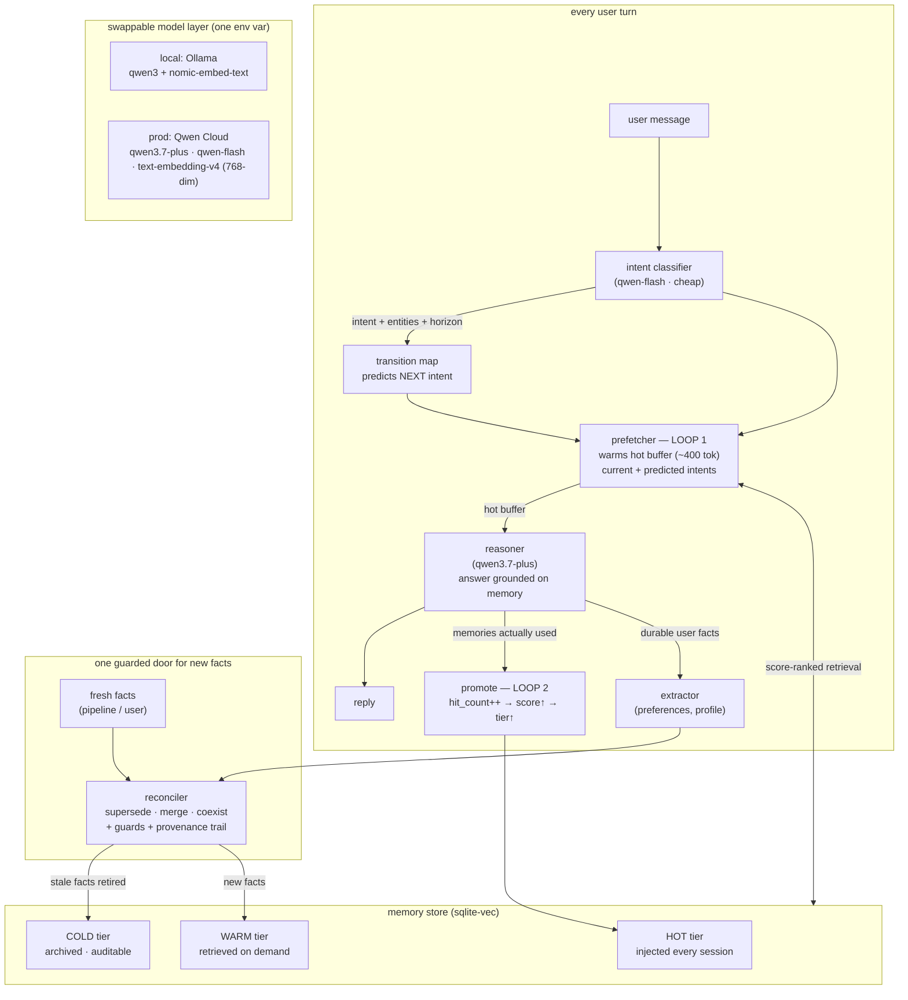

# momento
A travel planner memory agent
# momento — a travel memory agent that forgets on purpose

*Global AI Hackathon · Qwen Cloud · Track 1: MemoryAgent* <!-- TODO: confirm exact track string from the hackathon page -->

**momento** is a travel-planning agent with persistent, self-cleaning memory. It learns you
permanently, remembers across sessions and weeks, and keeps destination facts current —
retiring stale facts *before* they steer you wrong.

**The thesis:** it gets sharper and more trustworthy the more you use it — because what it
*expects to need* and what has *proven useful* continuously shape each other, while facts
that go stale are deliberately forgotten.

---

## The two compounding loops



**Loop 1 — predictive prefetch.** A cheap model call classifies each turn; a transition map
predicts what you'll ask next; the prefetcher warms the highest-scored memories for current
*and predicted* intents into a ~400-token buffer **before** the agent reasons. A miss costs a
wasted prefetch, never correctness (reactive vector search is the fallback).

**Loop 2 — use promotes.** Memories that actually ground an answer get their `hit_count`
bumped, raising their score and promoting them hot. Warming alone never promotes — *use* does.

**The loops compound:** scores rank what Loop 1 prefetches; Loop 1's hits feed Loop 2's
promotions; genuinely useful memories rise while unused ones sink.

**Forgetting on purpose.** Every fact carries a per-type freshness half-life (visa rules:
weeks · opening hours: days · geography: never). Volatile facts decay and retire on their own.
When a fresh fact *contradicts* a stored one, the reconciler decides supersede / merge /
coexist — with guards (a well-corroborated fact resists a single low-confidence source) and a
full provenance trail of what replaced what, when, and why.

## Memory record anatomy

Every fact carries: score, tier (hot/warm/cold), fact_type + half-life, hit_count,
last_accessed, confidence, corroboration, contradictions, intents[], subject, coordinates
(for map pins), superseded_by / supersedes, and provenance (source + URL).

## Demo — three sessions, one destination

1. **Learn** — plan a Kyoto week; state "I'm vegetarian and avoid crowds" → extracted, stored HOT.
2. **Return** — new session, transcript wiped → "where should we eat?" answers
   vegetarian-first, grounded on prefetched memory. Pins climb warm→hot as they're used.
3. **The world changed** — a re-scraped advisory arrives: visa-free entry ended → the
   reconciler retires the stale rule on screen (struck through, COLD, provenance trail) and
   answers ground on the new eVisa rule.

### Run it

```bash
# prerequisites: Python 3.11+, uv, Ollama (for local)
git clone https://github.com/Tusk9/momento.git && cd momento
uv venv && source .venv/bin/activate
uv sync                       # or: uv pip install -e .
ollama pull qwen3 && ollama pull nomic-embed-text

# local (free, offline)
python demo/seed_demo.py
python demo/server.py         # → http://localhost:5001

# judged configuration: Qwen Cloud (put QWEN_API_KEY in .env — see .env.example)
MODEL_BACKEND=qwen_cloud python demo/seed_demo.py
MODEL_BACKEND=qwen_cloud python momento/pipeline/fetch_pois.py   # real OSM POIs via the reconciler
MODEL_BACKEND=qwen_cloud python demo/server.py
```

> Seed and serve with the **same** backend — embeddings from different models occupy
> different vector spaces.

## Models (Qwen Cloud)

| role | model | why |
|---|---|---|
| reasoning + reconciliation + extraction | `qwen3.7-plus` | grounded answers; retiring memory is consequential |
| intent classification (every turn) | `qwen-flash` | cheap + fast; fires per message |
| embeddings | `text-embedding-v4` @ 768 dim | matches local nomic-embed-text → one DB serves dev & prod |

The model layer is one interface (`momento/models/`); `MODEL_BACKEND=ollama|qwen_cloud` flips
the whole stack.

## Honest scope & production path

- Base demo memory is seeded; **additional Kyoto POIs are fetched live from
  OpenStreetMap (Overpass API)** by `momento/pipeline/fetch_pois.py` and ingested
  through the same reconciler as every other fact. The visa fact change is
  injected to keep the reconciliation beat deterministic on camera; a production
  build would re-scrape advisisories on a schedule through the same door.
- The transition map is a hand-coded prior; `predict_next()` is the seam where a learned
  model drops in once real session data exists.
- Known limitation: the reasoner may propose specifics (restaurant names) beyond stored
  memory; constraining recommendations to provenance-backed facts is pipeline-era work.


## Repo map

```
momento/
├── momento/
│   ├── models/          # swappable LLM backend (Ollama ↔ Qwen Cloud)
│   ├── intent/          # taxonomy (13 intents) · classifier · transition map
│   ├── memory/          # schema · sqlite-vec store · scoring · prefetch (L1) · 
│   ├── pipeline/        # real data ingest: OSM Overpass POIs → reconciler
reconcile
│   └── agent.py         # per-turn orchestration (both loops + guarded ingest)
├── demo/                # Flask + Leaflet map demo (seed_demo.py · server.py)
├── test_*.py            # component + end-to-end tests
└── docs/                # architecture · submission artifacts
```

## License

MIT